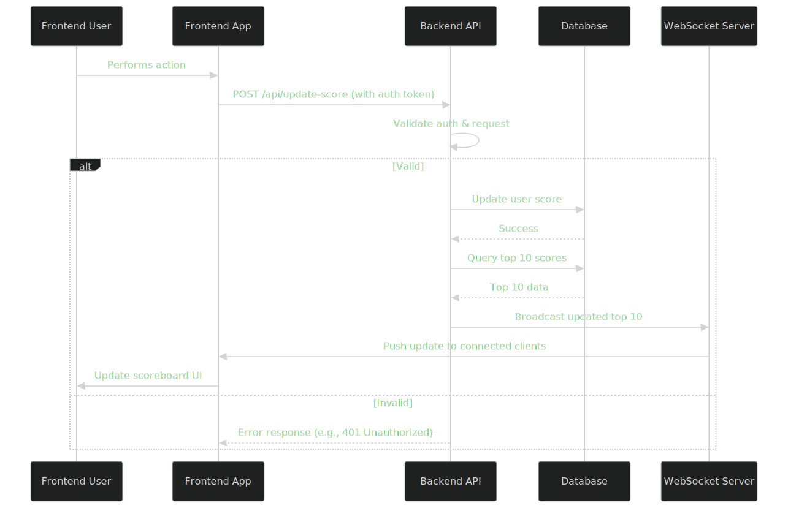

# Score Update Module API Specification

## Overview

This module provides a backend API service for securely updating user scores and enabling live updates to a website's scoreboard. The scoreboard displays the top 10 users based on their scores. Users perform actions on the frontend that increment their scores, triggering an API call to this service. The service ensures that score updates are authorized to prevent malicious activity. Additionally, it supports real-time broadcasting of scoreboard changes to connected clients for live updates.

This specification is intended for the backend engineering team to implement the module. It assumes a modern web framework (e.g., Node.js with Express, Python with FastAPI, or similar) and a database (e.g., PostgreSQL or MongoDB) for storing user scores. Real-time updates can be implemented using WebSockets (e.g., via Socket.IO or native WebSocket APIs).

## Requirements

- **Scoreboard Display**: The frontend website shows the top 10 users by score. This module must provide an API to fetch the current top 10 scores.
- **Live Updates**: Changes to scores should be pushed in real-time to the frontend without requiring page refreshes.
- **Score Increment**: Upon completing an action, the frontend dispatches an API call to increment a user's score by a fixed amount (e.g., +1 per action; configurable).
- **Security**: Prevent unauthorized score updates. All updates must be authenticated and validated.
- **Data Storage**: Scores are stored per user in a database, with fields like `user_id`, `username`, and `score`.
- **Scalability**: Handle concurrent updates and broadcasts efficiently.

## Architecture and Flow

### High-Level Flow

1. User performs an action on the frontend.
2. Frontend sends an authenticated API request to the backend to update the score.
3. Backend validates the request, updates the user's score in the database.
4. Backend recalculates the top 10 scores.
5. Backend broadcasts the updated top 10 to all connected clients via WebSockets.
6. Connected frontends receive the update and refresh the scoreboard in real-time.

### Diagram

The following diagram illustrates the execution flow using Mermaid syntax. Render it in a Markdown viewer or tool that supports Mermaid.



This diagram shows the happy path and error handling for invalid requests. Note: The WebSocket Server can be integrated into the Backend API for simplicity.

## API Endpoints

### 1. Update Score (POST /api/update-score)

- **Description**: Increments the authenticated user's score by a specified amount (default +1). Triggers a recalculation and broadcast of the top 10 scores.
- **Authentication**: Required. Use JWT (JSON Web Tokens) or API keys. The request must include a valid token in the `Authorization` header (e.g., `Bearer <token>`).
- **Request Body** (JSON):
  ```json
  {
    "increment": 1  // Optional, default 1; must be positive integer
  }
  ```
- **Response**:
  - Success (200 OK):
    ```json
    {
      "status": "success",
      "new_score": 42  // User's updated score
    }
    ```
  - Error (400 Bad Request): Invalid increment value.
  - Error (401 Unauthorized): Invalid or missing auth token.
  - Error (500 Internal Server Error): Database failure.
- **Validation**:
  - Ensure the user exists.
  - Rate-limit requests (e.g., max 10 updates per minute per user) to prevent abuse.
  - Verify the action was legitimately completed (e.g., via a nonce or session-based check if integrated with action logic).

### 2. Get Top 10 Scores (GET /api/top-scores)

- **Description**: Fetches the current top 10 users by score for initial scoreboard load.
- **Authentication**: Optional (public endpoint for read-only access).
- **Query Parameters**: None.
- **Response** (200 OK):
  ```json
  {
    "top_scores": [
      {"user_id": "123", "username": "user1", "score": 100},
      {"user_id": "456", "username": "user2", "score": 90},
      // ... up to 10
    ]
  }
  ```
- **Error** (500 Internal Server Error): Database failure.

### 3. WebSocket for Live Updates (/ws/scoreboard)

- **Description**: Clients connect to this WebSocket endpoint to receive real-time updates whenever the top 10 changes.
- **Connection**: Use wss:// (secure) in production.
- **Authentication**: Optional; if required, pass token as query param (e.g., ?token=<jwt>).
- **Events**:
  - On connect: Server sends current top 10 as an initial message.
  - On score update: Server broadcasts `{ "event": "update", "top_scores": [...] }` (same format as GET response).
- **Implementation Note**: Use a pub/sub pattern (e.g., Redis Pub/Sub) if scaling across multiple servers.

## Database Schema

- **Table: users_scores**
  - `user_id` (PK, string/uuid): Unique user identifier.
  - `username` (string): Display name.
  - `score` (integer): Current score, default 0.
  - Indexes: On `score` DESC for efficient top-N queries.

For top 10 retrieval: Use `SELECT * FROM users_scores ORDER BY score DESC LIMIT 10;`.

## Security Considerations

- **Authentication**: Mandate JWTs signed with a secret key. Validate token expiration and user claims.
- **Authorization**: Ensure the requesting user can only update their own score (extract user_id from token).
- **Input Validation**: Sanitize inputs to prevent SQL injection or other attacks.
- **Rate Limiting**: Implement per-user limits to mitigate DDoS or spam.
- **Auditing**: Log all update requests for monitoring suspicious activity.
- **HTTPS**: Enforce TLS for all API calls.

## Implementation Guidelines

- **Framework**: Recommend FastAPI (Python) for async support or Express.js (Node.js) with Socket.IO for WebSockets.
- **Database**: Use an ORM like SQLAlchemy or Mongoose for safe queries.
- **Testing**: Write unit tests for endpoints, integration tests for WebSocket broadcasts, and security tests (e.g., fuzzing invalid tokens).
- **Error Handling**: Use structured error responses with codes (e.g., { "error": "invalid_token", "message": "..." }).
- **Monitoring**: Integrate logging (e.g., ELK stack) and metrics (e.g., Prometheus) for score update frequency.

## Additional Comments for Improvement

- **Performance Optimization**: For high-traffic scenarios, cache the top 10 in Redis and invalidate on updates to reduce database load.
- **Score Calculation Enhancements**: If actions have variable point values, extend the request body to include an "action_type" and map it to points server-side for better control.
- **Anti-Cheat Measures**: Integrate CAPTCHA or proof-of-action (e.g., signed payloads from action completion) if cheating is a concern.
- **Internationalization**: Add support for usernames with non-ASCII characters.
- **Accessibility**: Ensure the frontend scoreboard (not in scope) is accessible; backend can provide alt-text or metadata if needed.
- **Future Scalability**: Consider sharding the database if user base grows beyond millions.
- **Documentation Expansion**: Once implemented, add Swagger/OpenAPI docs for the API endpoints to auto-generate client code.